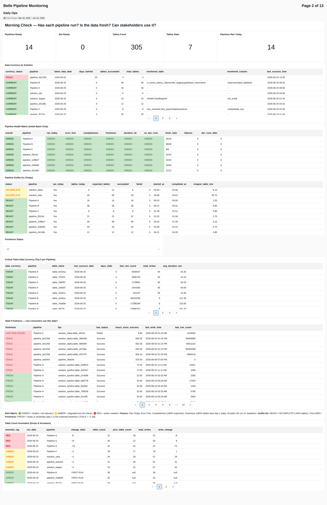

# Bellerophon (Belle)

**Config-driven, DAG-aware batch orchestration for Azure Databricks.**

[](#changelog) [](#) [](#) [](#license)


---

## Table of Contents

- [What is Belle?](#what-is-belle)
- [When to Use Belle](#when-to-use-belle)
- [Key Features](#key-features)
- [Quick Start](#quick-start)
- [Architecture](#architecture)
- [Load Modes](#load-modes)
- [Documentation Index](#documentation-index)
- [Monitoring Dashboard](#monitoring-dashboard)
- [Tests & Demos](#tests--demos)
- [Deployment](#deployment)
- [Repository Structure](#repository-structure)
- [Contributing](#contributing)
- [Changelog](#changelog)
- [License](#license)

---

## What is Belle?

Bellerophon ("Belle") is an **open-source**, config-driven batch orchestration framework that materialises PySpark DataFrames into Delta Lake tables on Azure Databricks. It replaces ad-hoc write logic with a declarative pipeline model: you define *what* tables you want and *how* they relate — Belle handles the execution order, parallelism, storage lifecycle, encryption, logging, and maintenance.

Belle is open-source because it is a product for all — any team on Azure Databricks can adopt it. There is no proprietary lock-in, no licensing, and no vendor dependency.

Belle is **not** a scheduling tool. It runs *inside* a Databricks notebook (invoked by a scheduled Job or ADF pipeline) and orchestrates the write operations for a set of tables within a single execution run.

---

## When to Use Belle

For a **single isolated query writing a small dataset**, Belle adds a thin layer of overhead versus writing the Delta table directly with `df.write.saveAsTable()`. If that is genuinely all you need, you can absolutely write Delta directly.

However, the moment you have a **pipeline or solution** — multiple tables, dependencies, incremental loads, encryption, logging, or any need for resilience — Belle offers quality, performance, and resilience far greater than the cost. Without an orchestrator, you forfeit:

- Dependency-ordered parallelism (DAG execution)
- Automatic retry on transient failures (exponential backoff)
- Structured logging and error codes (every write audited)
- Memory management (persist/unpersist lifecycle)
- Schema drift detection (automatic alerting)
- Scheduled maintenance (VACUUM, OPTIMIZE, compaction)
- Column-level encryption with key rotation
- Production/interactive mode auto-detection
- Comprehensive operational dashboard (13 pages, ai_forecast)

**Belle is NOT a replacement for:**
- Azure Data Factory / Databricks Jobs (scheduling)
- Lakeflow Spark Declarative Pipelines (streaming-first pipelines)
- dbt (SQL-only transformation)

Belle sits inside a single notebook execution and orchestrates the *write layer*. It complements — not replaces — your scheduling and transformation tools.

---

## Key Features

| Feature | Description |
| --- | --- |
| **DAG Orchestration** | Builds a dependency graph from your config, sorts into parallel stages, and executes via ThreadPoolExecutor. Visual ASCII/SVG DAG output before execution. |
| **5 Load Modes** | `full` (overwrite), `merge` (upsert via merge keys), `insert` (append-only), `fast` (optimised append), `partition` (partition-level overwrite) |
| **Column Encryption** | AES-256 column-level encryption. Encrypt on write, decrypt on read. Key rotation support. Per-table or per-column granularity. |
| **Schema Drift Detection** | MD5 hash of schema captured per write. Changes logged and flagged automatically. |
| **Retry Logic** | Exponential backoff (configurable base/max). Automatic retry on transient Spark errors (OOM, shuffle failures). |
| **Maintenance Scheduler** | Automated VACUUM (configurable retention) + OPTIMIZE (Z-ORDER support) + file compaction. Runs post-write on schedule. |
| **Structured Logging** | Every table write produces one log row: duration, row count, error code, schema snapshot, cluster ID, user, run correlation ID. |
| **Memory Management** | Automatic persist/unpersist lifecycle. DataFrames cached only for their dependency window, then released. |
| **Pre-flight Validation** | Config validator catches errors (missing merge keys, invalid load modes, circular dependencies) before execution begins. |
| **Progress Tracking** | Visual progress bar with ETA during execution. Stage-by-stage completion reporting. |
| **Production Auto-detect** | Automatically detects Job vs interactive context. Adjusts logging, paths, and behaviour accordingly. |
| **Monitoring Dashboard** | 13-page operational dashboard with ai_forecast projections, RAG status, SLA tracking, FinOps, and anomaly detection. |
| **Genie AI Space** | Natural-language query interface over Belle log data via Databricks Genie. |

---

## Quick Start

### 1. Copy `bellerophon_core` into your workspace

Place the notebook alongside your pipeline notebook (or in a shared location):
```
/Users/you@company.com/my_project/
├── bellerophon_core        ← Copy from core/
└── my_pipeline             ← Your notebook
```

### 2. Load Belle

```python
%run ./bellerophon_core
```

### 3. Build your DataFrames (your ETL logic)

```python
df_customers = (
    spark.table("raw.customers")
    .filter("active = true")
    .withColumn("updated_at", F.current_timestamp())
)

df_orders = (
    spark.table("raw.orders")
    .join(df_customers.select("customer_id"), "customer_id")
)
```

### 4. Register outputs

```python
belle.OutputRegistry.set_output("dim_customer", df_customers)
belle.OutputRegistry.set_output("fact_order", df_orders)
```

### 5. Define table configuration

```python
TABLES_CONFIG = {
    "dim_customer": {
        "database": "my_semantic",
        "load_mode": "merge",
        "merge_keys": ["customer_id"],
        "dependencies": [],
        "tags": {"domain": "CRM", "layer": "semantic"},
    },
    "fact_order": {
        "database": "my_semantic",
        "load_mode": "merge",
        "merge_keys": ["order_id"],
        "dependencies": ["dim_customer"],  # Waits for dim_customer
        "tags": {"domain": "Sales", "layer": "semantic"},
    },
}
```

### 6. Orchestrate

```python
belle.Orchestrator(TABLES_CONFIG).run()
```

Belle will:
1. Validate your config (pre-flight checks)
2. Build the DAG and display the execution plan
3. Execute `dim_customer` first (Stage 1)
4. Execute `fact_order` after (Stage 2, depends on dim_customer)
5. Log every write to `bellerophon_log_table`
6. Run scheduled maintenance (VACUUM/OPTIMIZE) if due

---

## Architecture

```
┌─────────────────────────────────────────────────────────────────────┐
│  YOUR CONSUMING NOTEBOOK                                            │
│                                                                     │
│  1. %run ./bellerophon_core          ← Load framework               │
│  2. Build DataFrames (PySpark)       ← Your ETL logic               │
│  3. Register outputs                 ← OutputRegistry.set_output()   │
│  4. Define TABLES_CONFIG             ← Declarative table manifest    │
│  5. Orchestrate                      ← belle.Orchestrator().run()    │
└───────────────────────────────────────┬─────────────────────────────┘
                                        │
                                        ▼
┌─────────────────────────────────────────────────────────────────────┐
│  BELLEROPHON CORE                                                   │
│                                                                     │
│  ┌────────────┐  ┌────────────┐  ┌──────────────┐  ┌────────────┐ │
│  │  Config    │  │ Pre-flight │  │ DAG          │  │Maintenance │ │
│  │  Validator │  │ Validator  │  │ Visualizer   │  │ Scheduler  │ │
│  └────────────┘  └────────────┘  └──────────────┘  └────────────┘ │
│                                                                     │
│  ┌──────────────────────────────────────────────────────────────┐  │
│  │  ORCHESTRATOR                                                │  │
│  │  • Build DAG from dependencies                               │  │
│  │  • Sort into parallel stages                                 │  │
│  │  • ThreadPoolExecutor per stage                              │  │
│  │  • Persist/unpersist lifecycle                               │  │
│  │  • Retry handler (exponential backoff)                       │  │
│  │  • Progress tracker (visual ETA)                             │  │
│  └──────────────────────────────────────────────────────────────┘  │
│                         │                                           │
│                         ▼                                           │
│  ┌──────────────────────────────────────────────────────────────┐  │
│  │  MATERIALISE DATAFRAME                                       │  │
│  │  • Load mode router (full/merge/insert/fast/partition)       │  │
│  │  • Schema capture + drift detection                          │  │
│  │  • Encryption (AES-256, per-column)                          │  │
│  │  • Delta write (saveAsTable / merge / insertInto)            │  │
│  │  • OOM recovery wrapper (resilient_materialise_table)        │  │
│  └──────────────────────────────────────────────────────────────┘  │
│                         │                                           │
│                         ▼                                           │
│  ┌──────────────────────────────────────────────────────────────┐  │
│  │  LOGGER                                                      │  │
│  │  • One row per table write (success or failure)              │  │
│  │  • Duration, row count, schema hash, error code/message      │  │
│  │  • Correlation: run_id + parent_run_id (ADF linkage)         │  │
│  │  • Auto-cleanup (configurable retention)                     │  │
│  └──────────────────────────────────────────────────────────────┘  │
└─────────────────────────────────────────────────────────────────────┘
                         │
                         ▼
              ┌────────────────────┐
              │  DELTA LAKE TABLE  │  (+ bellerophon_log_table)
              └────────────────────┘
```

---

## Load Modes

| Mode | Behaviour | Use Case |
| --- | --- | --- |
| `full` | DROP + recreate (or overwrite) | Small dimensions, lookup tables |
| `merge` | MERGE INTO on `merge_keys` (upsert) | SCD1 dimensions, fact tables with updates |
| `insert` | INSERT INTO (append-only) | Immutable event streams |
| `fast` | Optimised append with partition pruning | High-volume append tables |
| `partition` | Partition-level overwrite (replaceWhere) | Large partitioned facts (reprocess one partition) |

See [05_User_Guide_Standard_Materialisation.md](docs/05_User_Guide_Standard_Materialisation.md) and [06_User_Guide_Fast_and_Partition_Modes.md](docs/06_User_Guide_Fast_and_Partition_Modes.md) for full details.

---

## Documentation Index

### Getting Started

| # | Document | Description | Audience |
| --- | --- | --- | --- |
| 01 | [Full Technical README](docs/01_README.md) | Complete feature overview, architecture, and reference | Everyone |
| 02 | [New Starter Guide](docs/02_New_Starter_Guide.md) | Step-by-step onboarding tutorial | New users |

### Architecture & Configuration

| # | Document | Description | Audience |
| --- | --- | --- | --- |
| 03 | [Architecture & Design](docs/03_Architecture_and_Design.md) | Internal design, class structure, execution model | Engineers |
| 04 | [Configuration Reference](docs/04_Configuration_Reference.md) | Complete TABLES_CONFIG schema with all options | Everyone |
| A1 | [Appendix: Config Settings](docs/A1_Appendix_Config_Settings.md) | Global settings, environment variables, overrides | Platform team |

### User Guides

| # | Document | Description | Audience |
| --- | --- | --- | --- |
| 05 | [Standard Materialisation](docs/05_User_Guide_Standard_Materialisation.md) | `full`, `merge`, `insert` modes with examples | Data engineers |
| 06 | [Fast & Partition Modes](docs/06_User_Guide_Fast_and_Partition_Modes.md) | High-volume append + partition overwrite patterns | Data engineers |
| 07 | [Encryption Guide](docs/07_User_Guide_Encryption.md) | AES-256 column encryption, key rotation, read patterns | Data engineers, security |

### Operations & Production

| # | Document | Description | Audience |
| --- | --- | --- | --- |
| 08 | [Operations Runbook](docs/08_Operations_Runbook.md) | Deployment, monitoring, maintenance, error recovery | SRE, platform ops |
| 09 | [Troubleshooting Guide](docs/09_Troubleshooting_Guide.md) | Common errors, diagnostics, resolution steps | On-call engineers |
| 12 | [Migration & Upgrade Guide](docs/12_Migration_and_Upgrade_Guide.md) | Version upgrades, breaking changes, migration scripts | Platform team |

### Testing & Quality

| # | Document | Description | Audience |
| --- | --- | --- | --- |
| 10 | [Testing Guide](docs/10_Testing_Guide.md) | How to write and run tests for Belle pipelines | Data engineers |
| 15 | [Feature Testing Checklist](docs/15_Feature_Testing_Checklist.md) | Pre-release verification checklist | Maintainers |
| 16 | [Validator Guide](docs/16_Validator_Guide.md) | Pre-flight validation rules and custom validators | Data engineers |

### Reference

| # | Document | Description | Audience |
| --- | --- | --- | --- |
| 11 | [API Reference](docs/11_API_Reference.md) | All classes, methods, and function signatures | Engineers |
| 14 | [Log Table Deep Dive](docs/14_Log_Deep_Dive.md) | Log schema, query patterns, dashboard integration | Everyone |

### Community

| # | Document | Description | Audience |
| --- | --- | --- | --- |
| 13 | [Contributing Guide](docs/13_Contributing_Guide.md) | How to contribute, PR process, coding standards | Contributors |
| 17 | [Dashboard Guide](docs/17_Dashboard_Guide.md) | All 13 dashboard pages, widgets, data refresh | Everyone |

---

## Monitoring Dashboard

Belle automatically logs every table write. The companion **Belle Pipeline Monitoring** dashboard (located in `dashboard/`) transforms this raw log data into 13 purpose-built operational pages.



### Dashboard Pages

| # | Page | Key Widgets |
| --- | --- | --- |
| 1 | Executive Overview | KPI counters, Gantt timeline, RAG status table |
| 2 | Daily Ops | RAG matrix, Go/No-Go table, freshness, anomalies |
| 3 | Delivery SLAs | P50/P90 completion, SLA pivot with RAG formatting |
| 4 | Data Quality | Row count anomalies (z-score), schema drift tracking |
| 5 | Issues & Incidents | Error code analysis, failure rate trends, blast radius |
| 6 | Performance | P95 duration bars, instability scatter, cost per table |
| 7 | Growth & Capacity | Volume trends, 30-day ai_forecast row projection |
| 8 | FinOps & Optimization | Cost attribution, 30-day ai_forecast cost projection |
| 9 | MoM Trends | Month-over-month RAG comparison |
| 10 | Tags & Domains | Business domain/layer breakdown |
| 11 | User Activity | Production vs interactive, compute hours by user |
| 12 | Actions & Next Steps | Prioritised engineering recommendations |
| 13 | Pipeline Deep-Dive | Exploratory drill-down (Gantt + scatter + detail) |

### Dashboard Setup

1. Copy `dashboard/belle_log_dashboard` notebook alongside your pipelines
2. Run all 5 cells — auto-discovers Belle log tables, unions, and produces 24 summary tables in `belle_dashboard` database
3. Open `dashboard/Belle Pipeline Monitoring.lvdash.json` — it queries those tables directly
4. Optional: schedule the notebook as a daily Job for automatic refresh

See [17_Dashboard_Guide.md](docs/17_Dashboard_Guide.md) for full documentation.

---

## Tests & Demos

### Test Suite (`tests/`)

| Notebook | What it validates |
| --- | --- |
| `test_backwards_compatibility` | Config from older versions still works |
| `test_encryption_roundtrip` | Encrypt → write → read → decrypt integrity |
| `test_fast_mode` | Fast-mode append correctness and idempotency |
| `test_maintenance_scheduler` | VACUUM/OPTIMIZE scheduling and execution |
| `test_partition_mode` | Partition-level overwrite with replaceWhere |

Run the full suite before any release — see [15_Feature_Testing_Checklist.md](docs/15_Feature_Testing_Checklist.md).

### Demos (`demos/`)

| Notebook | What it demonstrates |
| --- | --- |
| `01_Demo_All_Write_Modes` | End-to-end example of all 5 load modes with sample data |

---

## Deployment

### Option A: Databricks Jobs (Recommended)

1. Copy `core/bellerophon_core` into your project folder
2. Create your pipeline notebook with `%run ./bellerophon_core`
3. Create a Databricks Job pointing to your notebook
4. Schedule as required (cron expression)

Belle auto-detects production mode via the job context — no code changes needed.

### Option B: Azure Data Factory

Use a Databricks **Notebook** activity in ADF:
- **Notebook path:** `/Users/.../my_pipeline_notebook`
- Belle's `%run ./bellerophon_core` works normally inside the notebook
- Pass `parent_run_id` from ADF for cross-system correlation

### Option C: Interactive Development

Run the notebook manually on any cluster. Belle auto-detects interactive mode and adjusts:
- Database routing (uses `_dev` suffix databases)
- Logging level (verbose)
- Maintenance (skipped in interactive)

See [08_Operations_Runbook.md](docs/08_Operations_Runbook.md) for full deployment details.

---

## Repository Structure

```
bellerophon/
├── README.md                       ← You are here
├── CHANGELOG.md                    ← Version history
├── LICENSE                         ← MIT
├── .gitignore
├── core/
│   └── bellerophon_core            ← The framework (Databricks notebook)
├── dashboard/
│   ├── belle_log_dashboard         ← Data pipeline for dashboard tables
│   ├── Belle Pipeline Monitoring   ← Operational dashboard (.lvdash.json)
│   └── belle_genie_assistant.md    ← Genie AI space instructions
├── docs/                           ← 18 documentation files (see index above)
├── images/                         ← Dashboard screenshots (anonymised)
│   └── page1.png — page13.png
├── tests/                          ← 5 test notebooks
└── demos/                          ← Example notebooks
```

---

## Contributing

Contributions welcome. See [13_Contributing_Guide.md](docs/13_Contributing_Guide.md) for:
- Coding standards and conventions
- PR process and review requirements
- How to add new load modes or features
- Testing requirements before merge

---

## Changelog

See [CHANGELOG.md](CHANGELOG.md) for full version history.

**Recent highlights (v1.2.19):**
- 13-page operational monitoring dashboard with ai_forecast projections
- Hash-based anonymisation mode for documentation screenshots
- Repository restructure: `core/` + `dashboard/` subfolders
- 18-file documentation suite

---

## License

MIT License — see [LICENSE](LICENSE) for full text.

Copyright (c) 2025-2026 AXA Partners — Data Solution & Innovation Team
