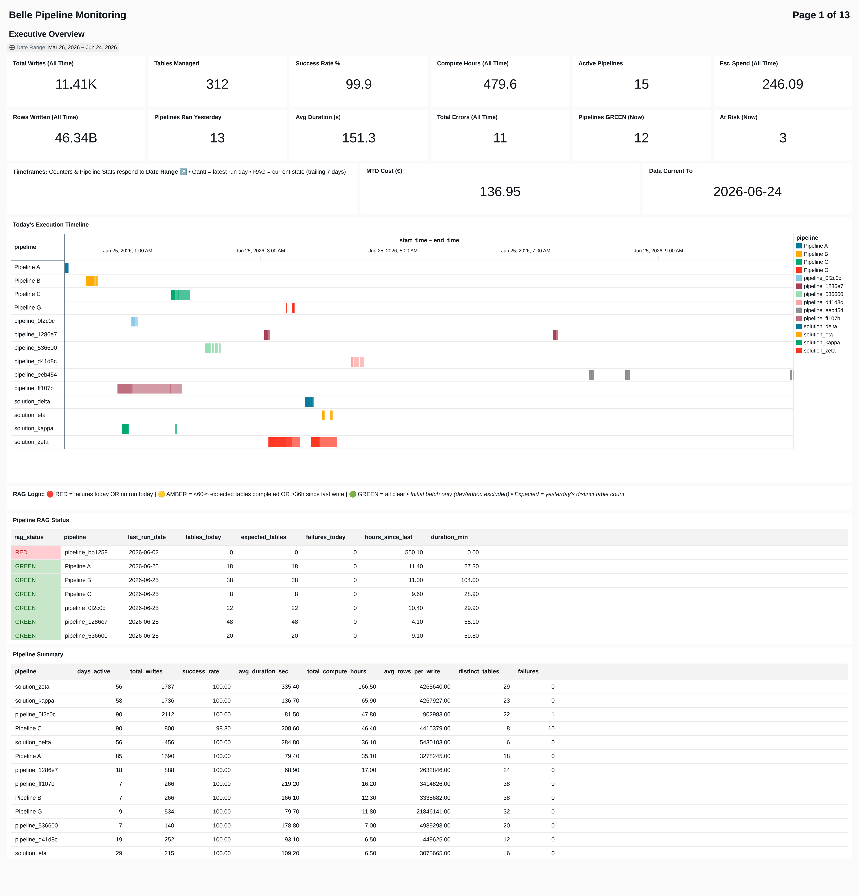

# Bellerophon (Belle) — Production Batch Orchestrator for Databricks

**Version:** 1.2.19  
**Platform:** Azure Databricks (DBR 13.3.x — 17.x)  
**Last Updated:** June 2026

---

## What is Bellerophon?

Bellerophon (nicknamed "Belle") is an **open-source**, config-driven, DAG-aware batch orchestration framework that materialises PySpark DataFrames into Delta Lake tables on Azure Databricks. It replaces ad-hoc write logic with a declarative pipeline model: you define *what* tables you want and *how* they relate — Belle handles the execution order, parallelism, storage lifecycle, encryption, logging, and maintenance.

Belle is open-source because it is a product for all — any team on Azure Databricks can adopt it. There is no proprietary lock-in, no licensing, and no vendor dependency. Fork it, extend it, contribute back.

Belle is not a scheduling tool. It runs *inside* a Databricks notebook (invoked by a scheduled Job or ADF pipeline) and orchestrates the write operations for a set of tables within a single execution run.

---

## When to Use Belle (and When Not To)

For a **single siloed query writing a small dataset**, Belle does add a thin layer of overhead versus writing the Delta table directly with `df.write.saveAsTable()`. If that is genuinely all you need, you can absolutely write Delta directly.

However, the moment you have a **pipeline or solution** — multiple tables, dependencies, incremental loads, encryption, logging, or any need for resilience — Belle offers quality, performance, and resilience far greater than the cost. Daisy-chaining raw writes without an orchestrator means you forfeit:

* Dependency-ordered parallelism
* Automatic retry on transient failures
* Structured logging and error codes
* Memory management (persist/unpersist lifecycle)
* Schema drift detection
* Scheduled maintenance (VACUUM, OPTIMIZE)
* Test mode isolation
* Production/development separation via `_dev` databases

The break-even point is roughly **2-3 tables with any dependency relationship**. Beyond that, Belle pays for itself on the first failed run it recovers from automatically.

---

## Development & Production on the Same Environment

One of Belle's most powerful features for day-to-day work is **automatic interactive/production mode separation**. When you run a Belle pipeline interactively (from your notebook), it targets `_dev` databases (e.g., `sales_semantic_dev`). When the same code runs in production (via a scheduled Job or service account), it targets the real databases (e.g., `sales_semantic`).

This means:
* **Dev and prod coexist safely** — same cluster, same source data, zero risk of overwriting production tables during development
* **No code changes between environments** — the mode detection is automatic
* **Production stays secure** — interactive users cannot accidentally write to production databases

See Section 5 in `03_Architecture_and_Design.md` for full details.

---

---

## How Belle Complements Native Databricks Orchestration

Belle does not replace Databricks Jobs, Lakeflow, or ADF. It fills the gap between **external scheduling** and **Delta Lake writes** — the layer inside your notebook where DataFrames become tables.

| Concern | Native Databricks | Belle adds |
|---------|-------------------|------------|
| Scheduling | Jobs, ADF triggers, cron | — (uses native scheduling) |
| Cluster management | Jobs compute, serverless | — (runs on whatever compute is attached) |
| Inter-notebook dependencies | Jobs task DAGs | — (uses native task graphs) |
| Intra-notebook table ordering | Manual / ad-hoc | **Automatic DAG from config dependencies** |
| Parallel table writes | Not built-in | **ThreadPoolExecutor with configurable workers** |
| Per-table retry | Not built-in | **Exponential backoff with OOM detection** |
| Write validation | Basic Delta schema enforcement | **Row count validation, schema drift detection** |
| Execution logging | Spark UI (ephemeral) | **Persistent Delta log table with structured error codes** |
| Incremental modes | Manual coding per table | **Config-driven: `refresh_n_days-7`, `merge`, `full_if_not_exists`** |
| FinOps visibility | Billing console (cluster-level) | **Per-table duration tracking → cost attribution** |

**Incremental processing made easier:** Instead of writing replaceWhere conditions, merge logic, and partition detection for each table, set `load_mode: "refresh_n_days-30"` in your config. Belle handles the rest.

**FinOps made easier:** Belle logs per-table execution duration to a persistent Delta table. Combined with cluster pricing, this gives table-level cost attribution — something billing consoles cannot provide. See `belle_log_dashboard` for ready-made FinOps views.

## Key Capabilities

| Capability | Description |
| --- | --- |
| DAG-driven execution | Topologically sorts tables by declared dependencies, executes in parallel stages via ThreadPoolExecutor |
| Multiple write modes | `full`, `insert`, `merge`, `update`, `delete`, `refresh_n_days-N`, `full_if_not_exists` |
| Inline encryption | AES-GCM encryption (per-column or legacy blob) applied during materialisation |
| Partition-aware writes | `replaceWhere` for surgical partition updates; rolling-window refresh |
| Fast mode | Lean bulk-write path for full-mode tables, skipping per-table overhead |
| Automatic maintenance | Scheduled or threshold-triggered VACUUM, OPTIMIZE, and full rebuilds |
| Delta log table | Per-run execution logs with error codes, durations, row counts, and schema snapshots |
| Schema validation | Pre-flight config checks: table existence, partition layout, merge key presence, dependency cycles |
| Memory management | Auto-persist/unpersist DataFrames based on dependency usage counts |
| OOM resilience | Retry with reduced parallelism on OutOfMemoryError |
| Test mode | Instance-isolated table suffixes for safe parallel testing |
| Tracing | Full variable capture at every decision point for post-mortem debugging |
| CSV export | Optional single-file CSV export (e.g., for downstream BI consumers) |
| Unity Catalog + Hive | Dual-namespace support (auto-detected from `target_database` format) |

---

## Monitoring Dashboard

Belle automatically logs every table write. The companion **Belle Pipeline Monitoring** dashboard surfaces this data across 13 pages covering executive overview, daily ops, SLAs, data quality, performance, FinOps, and more.



See [17_Dashboard_Guide.md](./docs/17_Dashboard_Guide.md) for full documentation of all dashboard pages and features.

---

## Architecture at a Glance

```
┌─────────────────────────────────────────────────────────────────────┐
│  CONSUMING NOTEBOOK (e.g., sales_pipeline, crm_staging_pipeline)    │
│                                                                     │
│  1. %run bellerophon_core          ← Load Belle into session        │
│  2. Build DataFrames (PySpark)     ← Your ETL logic                 │
│  3. Register outputs               ← OutputRegistry.set_output()    │
│  4. Define TABLES_CONFIG dict      ← Declarative table manifest     │
│  5. Orchestrate                    ← belle.Orchestrator(config).run()│
└───────────────────────────────────────┬─────────────────────────────┘
                                        │
                                        ▼
┌─────────────────────────────────────────────────────────────────────┐
│  BELLEROPHON CORE                                                   │
│                                                                     │
│  ┌──────────┐   ┌──────────┐   ┌──────────────┐   ┌────────────┐  │
│  │ Config   │   │ Validator│   │ DAGVisualizer│   │ Maintenance│  │
│  │ Validator│   │ (pre-    │   │ (ASCII/SVG   │   │ Scheduler  │  │
│  │ & Enrich │   │  flight) │   │  exec plan)  │   │ (VACUUM/   │  │
│  └──────────┘   └──────────┘   └──────────────┘   │  OPTIMIZE) │  │
│                                                     └────────────┘  │
│  ┌──────────────────────────────────────────────────────────────┐   │
│  │  ORCHESTRATOR                                                │   │
│  │  • Build DAG from dependencies                               │   │
│  │  • Sort into parallel stages                                 │   │
│  │  • ThreadPoolExecutor per stage                              │   │
│  │  • Persist/unpersist lifecycle                               │   │
│  │  • Retry handler (exponential backoff)                       │   │
│  │  • Progress tracker (visual ETA)                             │   │
│  └──────────────────────────────────────────────────────────────┘   │
│                         │                                           │
│                         ▼                                           │
│  ┌──────────────────────────────────────────────────────────────┐   │
│  │  MATERIALISE DATAFRAME                                       │   │
│  │  • Encrypt → Write (Delta) → CSV export → Log               │   │
│  │  • Modes: full / insert / merge / refresh_n_days / etc.      │   │
│  │  • Schema evolution, row count validation                    │   │
│  └──────────────────────────────────────────────────────────────┘   │
│                         │                                           │
│                         ▼                                           │
│  ┌─────────────┐   ┌──────────────┐   ┌────────────────────────┐   │
│  │ Delta Lake  │   │ CSV (blob)   │   │ bellerophon_log_table  │   │
│  │ (UC or Hive)│   │ (production) │   │ (execution audit)      │   │
│  └─────────────┘   └──────────────┘   └────────────────────────┘   │
└─────────────────────────────────────────────────────────────────────┘
```

---

## Quick Start

### 1. Load Belle into your notebook

```python
%run ./bellerophon_core
```

This makes the `belle` namespace available globally.

### 2. Build your DataFrames

```python
df_customers = spark.sql("SELECT * FROM raw.customers WHERE active = true")
df_orders = spark.sql("SELECT * FROM raw.orders WHERE order_date >= '2024-01-01'")
```

### 3. Register them in the OutputRegistry

```python
belle.OutputRegistry.set_output("my_database_dim_customer", df_customers)
belle.OutputRegistry.set_output("my_database_fact_order", df_orders)
```

Key format: `{target_database}_{result_table_name}` (dots replaced with underscores for UC namespaces).

### 4. Define your TABLES_CONFIG

```python
TABLES_CONFIG = {
    "my_database.dim_customer": {
        "target_database": "my_database",
        "result_table_name": "dim_customer",
        "load_mode": "full",
        "dependencies": [],
        "partition_by": [],
        "export_csv": False,
    },
    "my_database.fact_order": {
        "target_database": "my_database",
        "result_table_name": "fact_order",
        "load_mode": "merge",
        "merge_keys": ["order_id"],
        "dependencies": ["my_database.dim_customer"],
        "partition_by": ["order_date_key"],
        "export_csv": True,
    },
}
```

### 5. Run the orchestrator

```python
orchestrator = belle.Orchestrator(TABLES_CONFIG)
results = orchestrator.run(show_dag=True)
```

Belle will:
1. Validate all configs and detect issues pre-flight
2. Display the DAG execution plan
3. Materialise `dim_customer` first (Stage 1, no dependencies)
4. Then materialise `fact_order` (Stage 2, depends on dim_customer)
5. Log results, display summary, run maintenance if scheduled

---

## Document Index

This documentation suite is structured for different audiences and use cases:

| # | Document | Audience | Purpose |
| --- | --- | --- | --- |
| 01 | README (this file) | Everyone | Overview, quick start, orientation |
| 02 | New-Starter Guide | New joiners | Onboarding walkthrough, first-day setup |
| 03 | Architecture & Design | Architects, Senior Engineers | Deep design rationale, patterns, trade-offs |
| 04 | Configuration Reference | All engineers | Every config option, TABLES_CONFIG schema |
| 05 | User Guide — Standard Materialisation | Data Engineers, Analysts | Day-to-day usage, write modes, dependencies |
| 06 | User Guide — Fast & Partition Modes | Data Engineers | High-volume and partition-level write patterns |
| 07 | User Guide — Encryption | Data Engineers, Security | AES-GCM encryption configuration and decryption |
| 08 | Operations Runbook | Platform Ops, On-call | Maintenance, monitoring, error codes, recovery |
| 09 | Troubleshooting Guide | All engineers | Debugging failed runs, using Tracer, common fixes |
| 10 | Testing Guide | Developers | Test mode, writing tests, regression scenarios |
| 11 | API Reference | All engineers | Full class/method/function reference |
| 12 | Migration & Upgrade Guide | Platform Engineers | Storage moves, DBR upgrades, breaking changes |
| 13 | Contributing Guide | Developers modifying Belle | Code conventions, adding features, versioning |
| A1 | Appendix — Config Settings | All engineers | Exhaustive config matrix with examples |
| 14 | Log Deep Dive | All engineers, FinOps | Log schema, what logs capture/don't, extensibility |
| 15 | Feature Testing Checklist | Developers | Pre-release validation checklist |
| 16 | Validator Guide | All engineers | Static pipeline validation with `belle.Validator` |

---

## How Belle Fits into Your Pipelines

Belle is the materialisation engine for any Databricks notebook that writes multiple Delta tables. Each pipeline owns its ETL logic (DataFrame construction) and delegates the write, logging, maintenance, and lifecycle to Belle.

Typical deployments include:
* **Semantic layers** — Star schemas with dimension/fact dependencies and incremental refresh
* **Staging pipelines** — Source ingestion with deduplication and schema validation
* **Reporting pipelines** — Aggregated tables with partition-level updates
* **Multi-country architectures** — Per-country processing with worldwide union views

---

## Versioning

Belle follows semantic versioning within the 1.x.y series:

* **1.x.0** — Feature additions (new load modes, new config options)
* **1.x.y** — Bug fixes, performance improvements, non-breaking changes

Current version: **1.2.18**

---

## Platform Requirements

| Requirement | Supported |
| --- | --- |
| Databricks Runtime | 13.3.x, 14.x, 15.x, 16.x, 17.x |
| Cloud | Azure (ADLS Gen2 / Blob Storage) |
| Metastore | Unity Catalog or Hive Metastore |
| Cluster mode | Standard (classic), Serverless |
| Language | Python (PySpark) |
| Dependencies | pyspark, delta-spark, py4j (all pre-installed on DBR) |

---

## Support & Ownership

Bellerophon is **open-source** and maintained by the Data Solution & Innovation team within Customer & Operations . It is designed as a shared product — any team working on Azure Databricks is welcome to adopt, extend, or contribute to it.

**Repository:** `/path/to/belle/`  
**Canonical source:** `bellerophon_core` notebook in the above path  
**Licence:** Open-source (internal)

For questions, issues, or contributions, contact the Data Solution & Innovation team.
