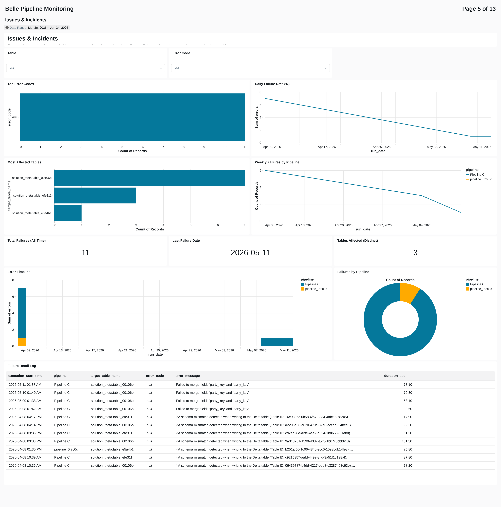

# Operations Runbook

**Audience:** Platform ops, on-call engineers, and anyone maintaining Belle-orchestrated pipelines in production.  
**Scope:** Day-to-day operations, maintenance, monitoring, error recovery, and deployment.

---

## 1. Production Deployment (ADF / Databricks Jobs)

### 1.1 Deploying via Databricks Jobs

The standard deployment method. Create a Databricks Job pointing to your consuming notebook:

* **Task type:** Notebook
* **Path:** `/Users/.../my_pipeline_notebook`
* **Cluster:** Your production cluster (or job cluster)
* **Schedule:** Cron expression as required

No changes to the notebook code are needed. Belle auto-detects production mode via the job context.

### 1.2 Deploying via Azure Data Factory (ADF)

#### Notebook Activity (Recommended)

Use a Databricks **Notebook** activity in ADF:
* **Notebook path:** `/Users/.../my_pipeline_notebook`
* No `.py` extension needed
* Belle's `%run ./bellerophon_core` works normally inside the notebook

#### Python Activity (Legacy/Alternative)

If using a Databricks **Python** activity in ADF:
* **Python file path:** Must reference a `.py` file
* Your consuming notebook must be exported as `.py` OR you need a wrapper `.py` that calls `dbutils.notebook.run()`
* The `%run` command works differently in `.py` context — use `exec(open(...).read())` or `dbutils.notebook.run()`

**Why the `.py` difference?** ADF's Python activity expects a standalone script, not a notebook. The Databricks notebook format supports `%run` magic commands natively. When deploying as Python, you lose magic command support and must use programmatic alternatives.

**Recommended pattern for ADF Python activity:**
```python
# wrapper.py (deployed to DBFS or workspace)
result = dbutils.notebook.run(
    "/Users/.../my_pipeline_notebook",
    timeout_seconds=7200,
    arguments={"run_id": "<adf-run-id>"}
)
```

### 1.3 Service Account Detection

Belle detects production mode via:
1. Username starting with `svc_aas` (configurable: `SERVICE_ACCOUNT_PREFIX`)
2. Presence of `spark.databricks.job.id` in Spark config
3. Username not matching email pattern

In production mode: CSV exports activate, logs persist to Delta, verbosity defaults apply.

### 1.4 External Run ID (ADF Correlation)

Pass ADF's run ID for log correlation:
```python
# In your notebook (read from ADF-passed widget)
adf_run_id = dbutils.widgets.get("adf_run_id")

orchestrator.run(external_run_id=adf_run_id)
```

This appears in the log table's `parent_run_id` column for cross-system tracing.

---

## 2. The Log Table

### 2.1 Location & Structure

Each target database has its own log table:
```
{target_database}.bellerophon_log_table
```

Stored at:
```
{BLOB_ROOT}/{target_database}/bellerophon_log_table
```

### 2.2 Why Logs Are Stored Per-Database (Not Centralised)

**Design rationale:**
* Permissions follow data — if you can read the database, you can read its logs
* No cross-database dependency (each pipeline is self-contained)
* No single bottleneck for parallel pipelines writing logs concurrently
* Log retention can differ per database (some regulated, some not)
* In interactive mode (`_dev` databases), logs are display-only (not persisted), keeping dev clean

**What to be careful of:**
* If you query logs across ALL pipelines, you need to UNION from multiple databases
* Each pipeline's orchestrator writes to its own database's log table
* Multiple concurrent pipelines writing to the SAME database is safe (Delta ACID appends)
* The log table is NEVER dropped by `force_full_rebuild` (explicitly protected)

### 2.3 Key Log Table Columns

| Column | Type | Description |
| --- | --- | --- |
| `run_id` | STRING | Unique ID per orchestrator.run() invocation |
| `log_id` | STRING | Unique ID per table write |
| `target_database` | STRING | Database written to |
| `result_table_name` | STRING | Table written |
| `success` | BOOLEAN | Whether write succeeded |
| `error_code` | STRING | BELLE-XXX error code (or BELLE-000 for success) |
| `error_message` | STRING | Error details (truncated) |
| `execution_duration_seconds` | DOUBLE | Time for this table write |
| `execution_start_time` | TIMESTAMP | When write started |
| `result_row_count` | LONG | Rows in target after write |
| `dag_stage` | INT | Which DAG stage this table was in |
| `load_mode` | STRING | Write mode used |
| `parent_run_id` | STRING | External run ID (ADF correlation) |
| `schema_json` | STRING | Target table schema (truncated to LOG_SCHEMA_JSON_MAX_LENGTH) |

### 2.4 Querying Logs

```sql
-- Last 10 runs for a database
SELECT run_id, MIN(execution_start_time) AS started,
       COUNT(*) AS tables, SUM(CASE WHEN success THEN 1 ELSE 0 END) AS succeeded
FROM sales_semantic.bellerophon_log_table
GROUP BY run_id
ORDER BY started DESC
LIMIT 10;

-- Failed tables in last run
SELECT result_table_name, error_code, error_message, execution_duration_seconds
FROM sales_semantic.bellerophon_log_table
WHERE run_id = '<latest-run-id>' AND success = false;
```

### 2.5 Log Retention

Belle auto-cleans logs older than `LOG_RETENTION_DAYS` (default: 90 days) at the end of each production run:

```python
# Adjust retention
belle.Config.LOG_RETENTION_DAYS = 180  # Keep 6 months

# Disable auto-cleanup
belle.Config.LOG_RETENTION_DAYS = 0
```

### 2.6 Purging Logs

To completely drop the log table (lose all history):
```python
belle.purge_logs(spark, "sales_semantic")
```

To clean up old entries without dropping:
```python
belle.Logger.cleanup_old_logs(spark, "sales_semantic", retention_days=30)
```

---

## 3. Monitoring Dashboard

Belle includes a full operational dashboard for daily health checks, SLA tracking, and incident investigation. Run the `belle_log_dashboard` notebook to refresh data, then open the published dashboard.

**Morning check (Daily Ops page):**


Key things to verify each morning:
* RAG matrix: all pipelines green for today's date
* Go/No-Go table: all pipelines completed before SLA time
* Freshness table: no STALE entries
* Anomaly table: no new SPIKE/DROP flags

**Incident investigation (Issues page):**



For full dashboard documentation, see [17_Dashboard_Guide.md](./17_Dashboard_Guide.md).

---

## 4. Error Codes

| Code | Category | Description | Typical Action |
| --- | --- | --- | --- |
| BELLE-000 | Success | Operation completed | None |
| BELLE-001 | Config | Table not found | Check table name/database spelling |
| BELLE-002 | Config | Merge key missing | Add `merge_keys` to config |
| BELLE-003 | Config | Invalid load mode | Check spelling against `VALID_LOAD_MODES` |
| BELLE-004 | Config | Config validation failed | Read error message for specifics |
| BELLE-005 | Config | Dependency cycle detected | Remove circular dependency |
| BELLE-010 | Data | Schema mismatch | See Section 4 (schema changes) |
| BELLE-011 | Data | Data quality failed | Inspect DataFrame quality |
| BELLE-012 | Data | Null value violation | Check non-nullable columns |
| BELLE-020 | Execution | Delta operation failed | Check cluster, retry |
| BELLE-021 | Execution | CSV export failed | Check blob storage access |
| BELLE-022 | Execution | Logging failed | Non-blocking; check log table path |
| BELLE-023 | Execution | Persist failed | Cluster memory pressure |
| BELLE-030 | Resource | Out of memory | Reduce parallelism, increase cluster |
| BELLE-031 | Resource | Timeout | Increase timeout, optimise query |
| BELLE-032 | Resource | Cluster error | Check cluster health |
| BELLE-040 | Permission | Permission denied | Check UC grants / service principal |
| BELLE-041 | Permission | Catalog access denied | Check catalog-level permissions |
| BELLE-999 | Unknown | Unclassified error | Check full stack trace |

---

## 4. Scheduled Maintenance

### 4.1 How Scheduling Works

Belle uses an "Nth weekday of month" pattern (not cron). Example: "2nd Sunday of the month."

```python
# Enable VACUUM on the 2nd Sunday of each month
belle.Config.ENABLE_SCHEDULED_VACUUM = True
belle.Config.SCHEDULED_VACUUM_DAY_OF_WEEK = 6      # Sunday
belle.Config.SCHEDULED_VACUUM_WEEK_OF_MONTH = 2    # 2nd occurrence
```

### 4.2 What Gets Triggered

When the orchestrator runs on a scheduled maintenance day:
1. `check_scheduled_maintenance()` detects today matches the schedule
2. After all DAG stages complete, maintenance executes:
   * VACUUM (if scheduled): Removes old data files beyond retention
   * OPTIMIZE (if scheduled): Compacts small files
   * Full rebuild (if scheduled): Sets force_rebuild on all tables

### 4.3 Intelligent Auto-Maintenance (Alternative)

Instead of fixed schedules, auto-maintenance triggers based on table health:

```python
# Enable threshold-based maintenance
belle.Config.ENABLE_INTELLIGENT_AUTO_OPTIMIZE = True
belle.Config.ENABLE_INTELLIGENT_AUTO_VACUUM = True

# OPTIMIZE triggers when:
# - More than 50 small files (<100MB each), OR
# - More than 100 total files, OR
# - Last OPTIMIZE was >7 days ago

# VACUUM triggers when:
# - Last VACUUM was >30 days ago, OR
# - >10% of data was deleted/updated
```

### 4.4 Dry Run Mode

```python
belle.Config.SCHEDULED_VACUUM_DRY_RUN = True  # Preview what would be deleted
belle.Config.INTELLIGENT_MAINTENANCE_DRY_RUN = True  # Preview auto-maintenance
```

---

## 5. Force Rebuild Operations

### 5.1 When to Force Rebuild

* Schema changes requiring purge (see `05_User_Guide` Section 4)
* Data corruption or inconsistency
* Key rotation (encryption)
* Scheduled monthly rebuild (SCD error failsafe)

### 5.2 How to Trigger

```python
# Per-table (safest)
TABLES_CONFIG["db.my_table"]["force_full_rebuild"] = True

# Global (all tables in this orchestrator)
orchestrator = belle.Orchestrator(config, global_force_rebuild=True)

# Scheduled (Nth weekday of month)
belle.Config.ENABLE_SCHEDULED_FULL_REBUILD = True
```

### 5.3 What Happens During Force Rebuild

1. `ensure_table_ready()` is called for each table
2. If table exists AND force_rebuild is True: `DROP TABLE IF EXISTS`
3. **Exception:** Log table is NEVER dropped (explicitly protected)
4. Table is then created fresh from DataFrame
5. Metadata is updated: `_table_exists = False`, `_effective_force_rebuild = True`

### 5.4 Post-Rebuild Cleanup

**Important:** Remove `force_full_rebuild: True` from your config after the rebuild run. Otherwise every subsequent run will drop and recreate.

---

## 6. Monitoring & Alerting

### 6.1 Key Metrics to Monitor

| Metric | Source | Alert threshold |
| --- | --- | --- |
| Run duration | Log table (`execution_duration_seconds`) | >2x historical average |
| Failed tables | Log table (`success = false`) | Any failure |
| Row count variance | Log table (`result_row_count`) | >10% change between runs |
| OOM events | Error code BELLE-030 | Any occurrence |
| Permission failures | Error codes BELLE-040/041 | Any occurrence |

### 6.2 Health Check Query

```sql
-- Pipeline health dashboard
SELECT
    run_id,
    MIN(execution_start_time) AS run_start,
    MAX(execution_start_time) AS run_end,
    COUNT(*) AS total_tables,
    SUM(CASE WHEN success THEN 1 ELSE 0 END) AS succeeded,
    SUM(CASE WHEN NOT success THEN 1 ELSE 0 END) AS failed,
    ROUND(SUM(execution_duration_seconds), 1) AS total_seconds,
    COLLECT_SET(CASE WHEN NOT success THEN error_code END) AS error_codes
FROM sales_semantic.bellerophon_log_table
WHERE execution_start_time >= current_date() - INTERVAL 7 DAYS
GROUP BY run_id
ORDER BY run_start DESC;
```

---

## 7. Common Operational Scenarios

### 7.1 "Pipeline ran but no tables were written"

**Cause:** OutputRegistry was cleared (cluster restart, notebook detach).
**Fix:** Rerun cells that build DataFrames and call `set_output()`, then rerun orchestrator.

### 7.2 "Log table has schema evolution errors"

**Cause:** `FEATURE_LOG_SCHEMA_EVOLUTION = False` with new log columns.
**Fix:** Either `belle.Config.FEATURE_LOG_SCHEMA_EVOLUTION = True` or drop and recreate log table.

### 7.3 "CSV export failed but tables wrote successfully"

**Cause:** Blob storage write permissions (interactive mode, or service principal lacks write).
**Impact:** Non-blocking. Tables are correct. Only CSV downstream (e.g., BI tools) is affected.
**Fix:** Check blob mount permissions for the service principal.

### 7.4 "Partition mismatch auto-drop surprised me"

**Cause:** You changed `partition_by` in config. Belle detected mismatch and auto-dropped.
**Impact:** Table was recreated with new partitioning. Data is rebuilt from DataFrame.
**Prevention:** Set `belle.Config.VERBOSITY = 3` to see pre-flight partition checks.

---

## 8. Storage Considerations

### 8.1 Interactive Mode Storage

* **Managed tables** in Databricks warehouse directory
* Uses `saveAsTable()` (no explicit LOCATION)
* Database suffix: `_dev` (e.g., `sales_semantic_dev`)
* No CSV export, no log persistence

### 8.2 Production Mode Storage

* **External tables** on blob (Hive) OR **managed tables** (Unity Catalog)
* External: explicit LOCATION at `{BLOB_ROOT}/{database}/{DATA_FOLDER}/{table}/`
* CSV exports: `{BLOB_ROOT}/{CSV_TEMP_FOLDER}/{database}/{table}/*.csv`
* Log table: `{BLOB_ROOT}/{database}/bellerophon_log_table`

### 8.3 Storage Cleanup

* VACUUM handles orphaned files from failed writes
* CSV exports are overwritten each run (single file, timestamped)
* Log table grows linearly; controlled by `LOG_RETENTION_DAYS`

---

*Last updated: June 2026*

---

## FinOps Monitoring

Belle's log table enables **table-level cost attribution** — something cluster-level billing cannot provide.

### Quick Cost Check

```sql
-- Top 10 most expensive tables (last 30 days)
SELECT
    CONCAT(target_database, '.', result_table_name) AS table_name,
    load_mode,
    COUNT(*) AS runs,
    ROUND(SUM(execution_duration_sec) / 3600, 2) AS compute_hours,
    ROUND(AVG(execution_duration_sec), 1) AS avg_sec
FROM your_database.bellerophon_log_table
WHERE success = true
  AND execution_start_time >= current_date() - INTERVAL 30 DAYS
  AND ran_in_interactive_mode = false
GROUP BY target_database, result_table_name, load_mode
ORDER BY compute_hours DESC
LIMIT 10
```

### Incremental Savings Validation

Compare cost-per-row across write modes to validate that switching from `full` to `refresh_n_days` actually reduced cost:

```sql
SELECT
    load_mode,
    ROUND(AVG(execution_duration_sec), 1) AS avg_duration,
    ROUND(AVG(result_row_count), 0) AS avg_rows,
    ROUND(
        AVG(execution_duration_sec) / NULLIF(AVG(result_row_count), 0) * 1e6, 3
    ) AS seconds_per_million_rows
FROM your_database.bellerophon_log_table
WHERE success = true AND ran_in_interactive_mode = false
GROUP BY load_mode
ORDER BY seconds_per_million_rows DESC
```

### Automated Monitoring

Run `belle_log_dashboard` on a schedule to produce persistent views for BI tools. The dashboard auto-discovers all Belle log tables and produces:
- Anomaly detection (row counts, performance regression)
- Freshness SLA tracking
- Parallelism effectiveness reporting
- Mode efficiency comparison
