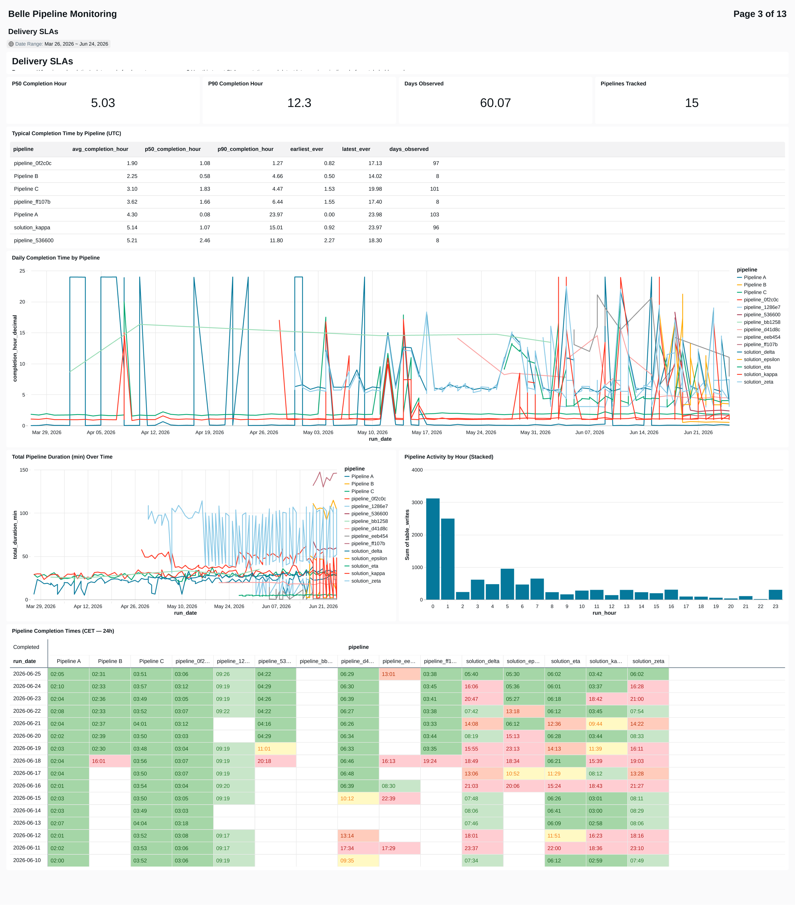
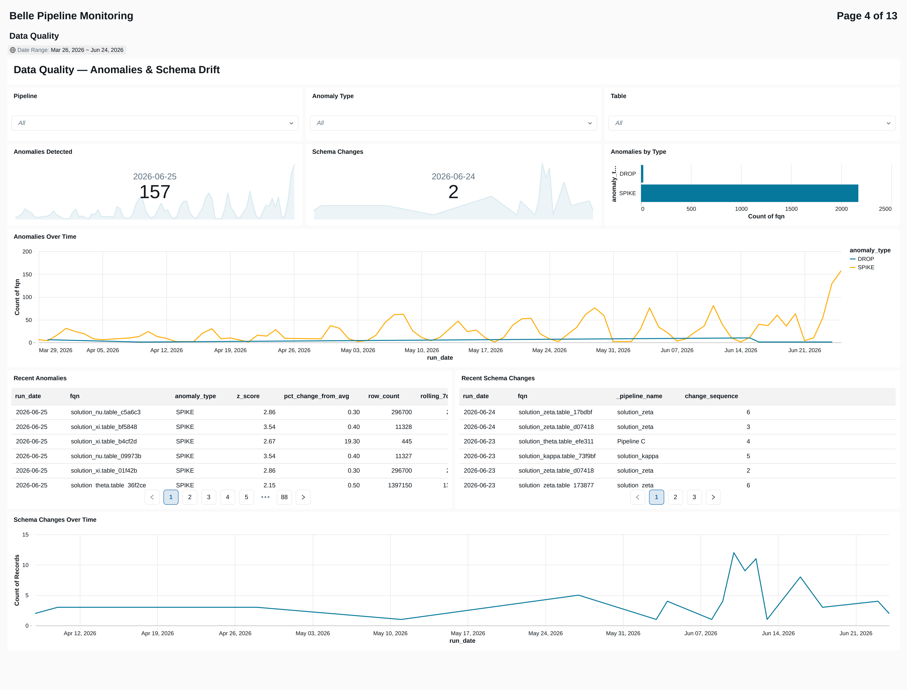
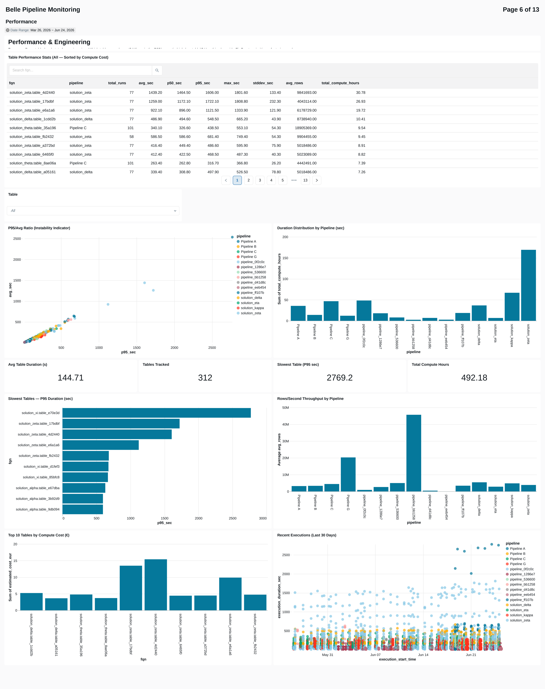
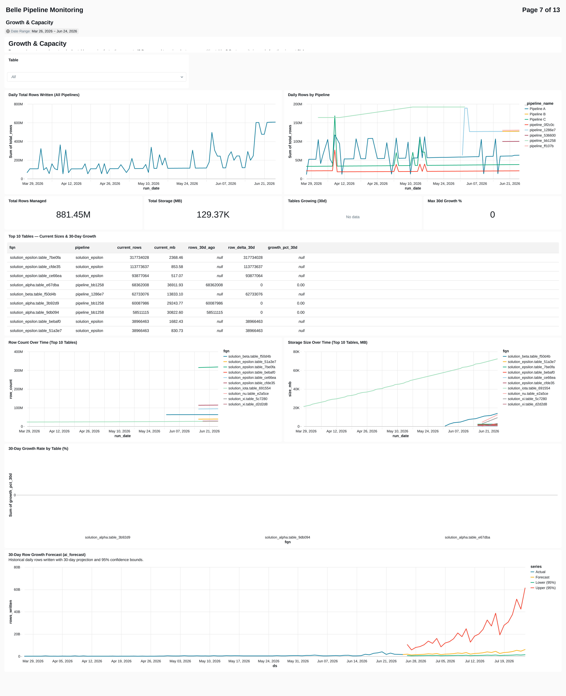
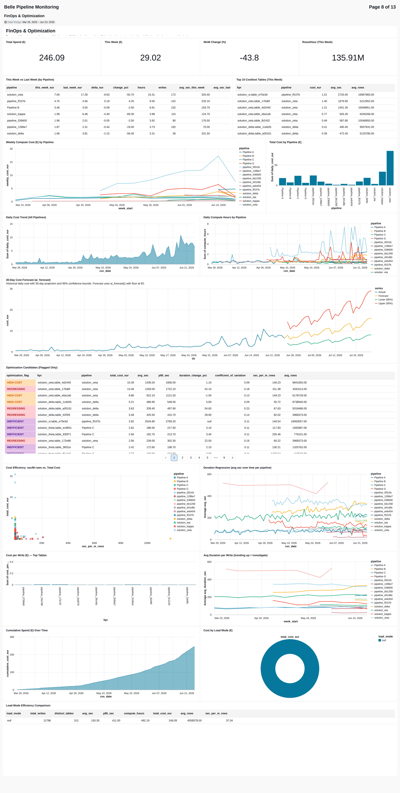
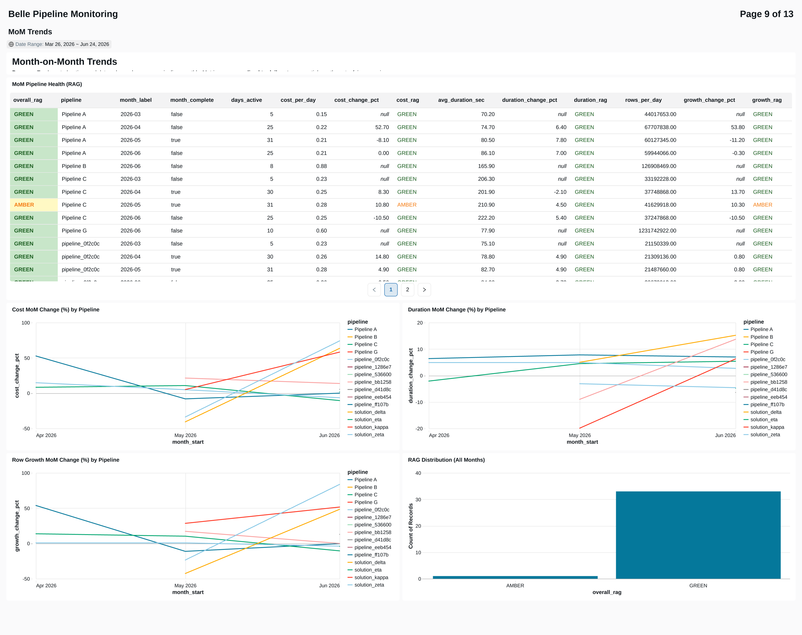
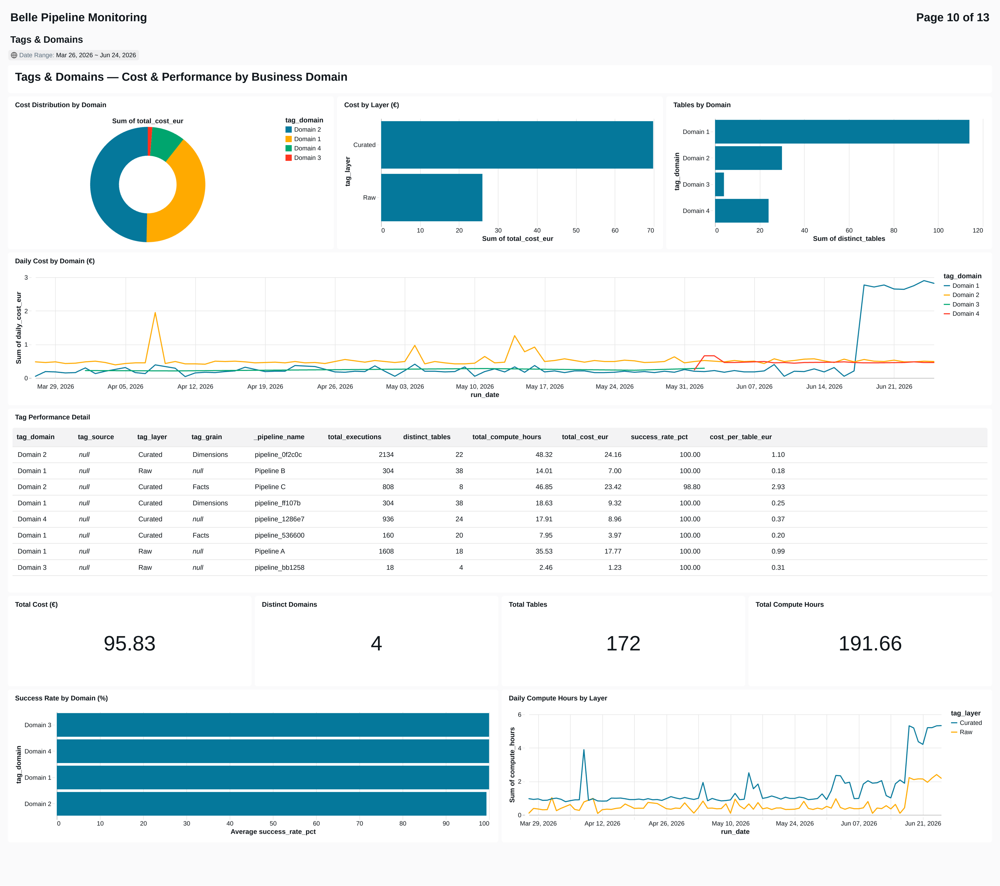
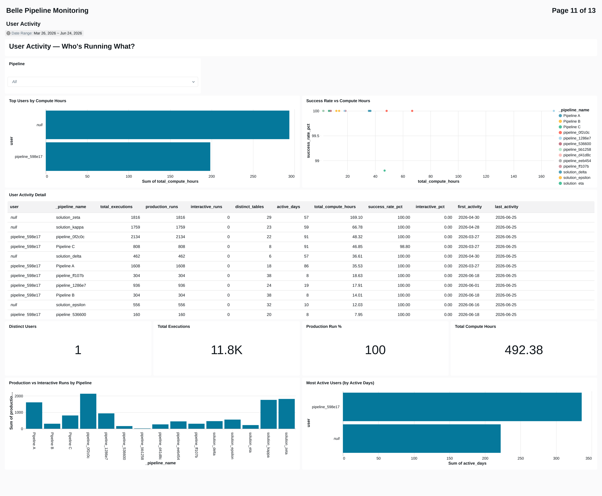
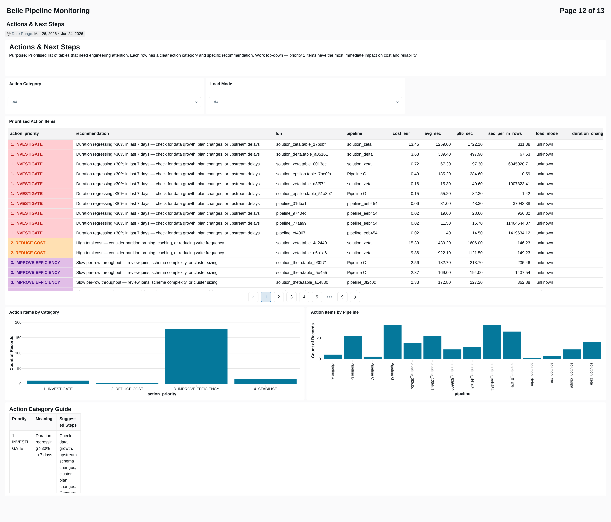
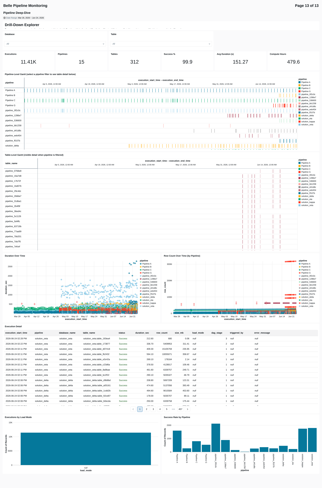

# Belle Pipeline Monitoring Dashboard

A comprehensive operational dashboard built on Bellerophon log data, providing real-time visibility into pipeline health, data quality, cost, and performance across all monitored solutions.

## Overview

The dashboard is powered by the `belle_log_dashboard` notebook which auto-discovers all Bellerophon log tables, unions them into a unified dataset, and produces 24 summary tables in the `belle_dashboard` database. The dashboard queries these tables directly.

**Key features:**
- 13 purpose-built pages covering different operational perspectives
- Global filters (Pipeline, Date Range, Domain, Layer) that cascade across pages
- ai_forecast() projections for cost and row-growth trends
- Conditional formatting (RAG status) on completion times and SLA breaches
- Anonymisation mode for documentation/presentation screenshots

---

## Pages

### 1. Executive Overview

**Purpose:** At-a-glance summary for leadership and morning stand-ups.

**Key widgets:**
- KPI counters: Total Writes, Tables Managed, Success Rate, Compute Hours, Active Pipelines, Est. Spend, MTD Cost, YTD Cost
- Gantt chart showing pipeline execution timelines
- RAG status table with conditional formatting
- Pipeline summary statistics

**Audience:** Engineering managers, SREs, platform leads.

---

### 2. Daily Ops

**Purpose:** Morning operational check — "Is everything OK today?"

**Key widgets:**
- Readiness KPIs (Ready / Not Ready / Fresh / Stale / Ran Today)
- Solution Currency table (last data date per solution)
- RAG matrix (pipeline × date with colour-coded status)
- Go/No-Go table (today's pipeline completions with started_at / completed_at)
- Freshness & SLA status table
- Row count anomaly table (flagged tables)

**Audience:** Data engineers on morning duty, SREs.

---

### 3. Delivery SLAs

**Purpose:** When is data ready for consumers? Statistical SLA analysis.

**Key widgets:**
- P50 and P90 completion hour KPIs
- Average Completion table (per-pipeline statistics)
- Completion hour trend line (over time)
- Duration trend and hourly distribution charts
- Completion pivot (pipeline × date heatmap with RAG formatting: green ≤07:00, red >15:00)

**Audience:** Data consumers, SLA owners, capacity planners.

---

### 4. Data Quality

**Purpose:** Are row counts stable? Has anything drifted?

**Key widgets:**
- Anomalies Detected counter (period)
- Schema Changes counter (period)
- Anomalies by Type bar chart
- Anomalies Over Time line (by anomaly type)
- Schema Changes Over Time line
- Recent Anomalies table (with z-scores)
- Recent Schema Changes table

**Filters:** Pipeline, Anomaly Type, Table (fqn)

**Audience:** Data governance, data engineers, QA.

---

### 5. Issues & Incidents

**Purpose:** What broke? Investigation starting point.

**Key widgets:**
- Failure KPIs (Total Failures, Distinct Tables Affected, Error Codes, Failure Rate)
- Top Error Codes bar (scrollable, top 10 viewport)
- Daily Failure Rate line
- Most Affected Tables bar (scrollable, top 10 viewport)
- Weekly Failures by Pipeline line
- Failures by Pipeline pie chart
- Error timeline and detail log table

**Filters:** Table, Error Code

**Audience:** On-call engineers, incident responders.

---

### 6. Performance

**Purpose:** How fast are tables executing? Where are bottlenecks?

**Key widgets:**
- Table Performance Stats (all tables, sorted by compute cost, searchable)
- Instability scatter (P95 vs avg, coloured by pipeline)
- Compute Hours by Pipeline bar
- Slowest Tables — P95 Duration bar (scrollable, top 10 viewport)
- Throughput bar (avg rows per write by pipeline)
- Cost per Table bar
- Recent Executions scatter (last 30 days, coloured by pipeline)

**Filters:** Table

**Audience:** Data engineers, performance tuners.

---

### 7. Growth & Capacity

**Purpose:** Are tables growing? Do we need to resize?

**Key widgets:**
- Daily Total Rows Written line (all pipelines)
- Daily Rows by Pipeline line
- KPIs: Total Rows, Total MB, Tables Growing, Max Growth %
- Volume table (top 10 tables by current size)
- Row Count Over Time (top 10 tables)
- Size Growth Over Time (top 10 tables)
- 30-Day Growth Rate by Table bar
- 30-Day Row Growth Forecast (ai_forecast with confidence bounds)

**Filters:** Table

**Audience:** Capacity planners, platform team.

---

### 8. FinOps & Optimization

**Purpose:** What does it cost? Where can we save?

**Key widgets:**
- KPIs: Total Spend, This Week, WoW Change %, Rows/Hour
- Weekly cost line and cost by pipeline bar
- Daily cost area and compute hours trend
- 30-Day Cost Forecast (ai_forecast with confidence bounds)
- Optimization Candidates table (flagged only: REGRESSING, UNSTABLE, HIGH COST, INEFFICIENT)
- Efficiency scatter (cost vs throughput)
- Cost Regression line
- Cumulative Cost area
- Cost by Load Mode pie
- Cost per Write bar (scrollable, top 10 viewport)

**Audience:** FinOps team, engineering managers.

---

### 9. MoM Trends

**Purpose:** Month-over-month health comparison.

**Key widgets:**
- Pipeline RAG table (month × pipeline matrix)
- Duration, cost, and success rate trend lines
- RAG distribution bar

**Audience:** Monthly reviews, leadership reporting.

---

### 10. Tags & Domains

**Purpose:** Performance breakdown by business domain and data layer.

**Key widgets:**
- KPIs: Total Cost, Domains, Tables, Compute Hours
- Cost Distribution by Domain pie
- Cost by Layer bar
- Tables by Domain bar
- Daily Cost by Domain line
- Success Rate by Domain horizontal bar
- Daily Compute Hours by Layer line
- Performance detail table

**Global filters applied:** Domain (Tag), Layer (Tag)

**Audience:** Domain owners, cost centre managers.

---

### 11. User Activity

**Purpose:** Who is running what? Production vs interactive split.

**Key widgets:**
- Pipeline filter (page-level, for `_pipeline_name`)
- Top Users bar (by compute hours)
- Success Rate scatter
- Activity detail table
- KPIs: Users, Executions, Production %, Compute Hours
- Production vs Interactive bar
- Active Days by User bar

**Audience:** Team leads, capacity planners.

---

### 12. Actions & Next Steps

**Purpose:** Prioritised engineering recommendations.

**Key widgets:**
- Action items table (sorted by priority: INVESTIGATE → REDUCE COST → IMPROVE EFFICIENCY → STABILISE → SWITCH TO INCREMENTAL → MONITOR)
- Actions by Category bar
- Actions by Pipeline bar
- Guidance text widget

**Filters:** Action Category, Load Mode

**Audience:** Sprint planning, engineering leads.

---

### 13. Pipeline Deep-Dive

**Purpose:** Exploratory drill-down for investigating specific tables/pipelines.

**Key widgets:**
- Gantt chart (execution timelines)
- Scatter plot (duration vs time)
- Full detail table (all columns, searchable)
- KPIs: Avg Duration, Max Duration, Total Writes, Distinct Tables
- Load Mode distribution bar
- Success/Failure breakdown bar

**Filters:** Pipeline (global), Database, Table

**Audience:** Anyone investigating a specific issue or table.

---

## Global Filters

The dashboard has a dedicated Global Filters page with:
- **Pipeline** — filters all datasets with a `pipeline` column across all pages
- **Date Range** — scopes Executive Overview and Pipeline Summary datasets
- **Domain (Tag)** — filters datasets with `tag_domain` (Tags & Domains page)
- **Layer (Tag)** — filters datasets with `tag_layer` (Tags & Domains page)

---

## Data Refresh

The dashboard reads from `belle_dashboard.*` tables which are populated by the `belle_log_dashboard` notebook. To refresh:

1. Run the notebook (all 5 cells in sequence) on a cluster with mount access
2. Open the published dashboard — datasets re-query on load
3. For scheduled refresh, set up a job to run the notebook daily

---

## Anonymisation Mode

For documentation screenshots or presentations where real solution names should not appear:

1. Set `_ANONYMISE_OUTPUT = True` in Cell 1 of the notebook
2. Run all cells — all 24 tables are rewritten with hash-based opaque names
3. No real names are hardcoded in the code — all replacements are MD5-derived
4. To revert: set `_ANONYMISE_OUTPUT = False` and re-run

The anonymisation uses context-specific UDFs:
- Pipelines → "Pipeline A" .. "Pipeline Z"
- Databases → "solution_alpha" .. "solution_omega"
- FQNs → "solution_X.table_HASH"
- Domains → "Domain 1" .. "Domain 9"
- Layers → "Raw", "Curated", "Processed", "Refined", "Landing"
- Users → "user_XXXX@example.com"

---

## Technical Details

### Underlying Tables (24)

| # | Table | Purpose |
| --- | --- | --- |
| 1 | belle_log_combined | Unified log (all pipelines, all dates) |
| 2 | pipeline_runs | Run-level aggregates |
| 3 | daily_success_rate | Daily success % by pipeline |
| 4 | data_growth | Row count & size by table × date |
| 5 | cost_attribution | Cost per table |
| 6 | performance_trend | Duration stats over time |
| 7 | error_breakdown | Error codes and messages |
| 8 | freshness | Hours since last success |
| 9 | mode_efficiency | Load mode comparison |
| 10 | hourly_distribution | Execution start hour patterns |
| 11 | table_reliability | MTBF, failure streaks, success rate |
| 12 | performance_percentiles | P50/P75/P90/P95/P99 per table |
| 13 | dag_stage_analysis | Stage bottleneck % |
| 14 | row_count_anomalies | Z-score spike/drop detection |
| 15 | cost_daily_trend | Daily cost with rolling averages |
| 16 | schema_changes | Schema hash change detection |
| 17 | run_concurrency | Parallelism factor per run |
| 18 | user_activity | User × pipeline activity summary |
| 19 | duration_forecast_input | Time-series shaped for ai_forecast |
| 20 | weekly_comparison | WoW deltas (cost, duration, success) |
| 21 | execution_day_patterns | Day-of-week capacity patterns |
| 22 | failure_blast_radius | Correlated failure groups |
| 23 | tag_performance | Cost & perf by domain/layer |
| 24 | tag_daily_trend | Daily trend by domain/layer |

### Dashboard Datasets (44)

Each dashboard page uses 2–6 datasets that query the tables above with appropriate filters, aggregations, and ordering. Key datasets include:
- `datasets/executive` — Executive Overview KPIs (parameterised by date_range)
- `datasets/daily_ops_*` — Daily Ops family (rag, go/nogo, freshness, anomalies)
- `datasets/cost_forecast` — ai_forecast 30-day cost projection
- `datasets/row_growth_forecast` — ai_forecast 30-day row growth projection
- `datasets/period_stats` — MTD/YTD aggregated metrics
- `datasets/actions` — Prioritised recommendations with COALESCE'd load_mode
